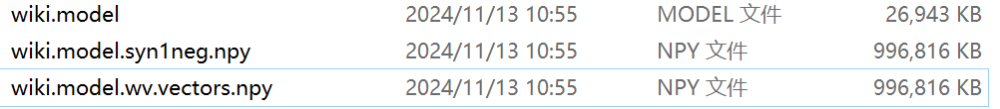
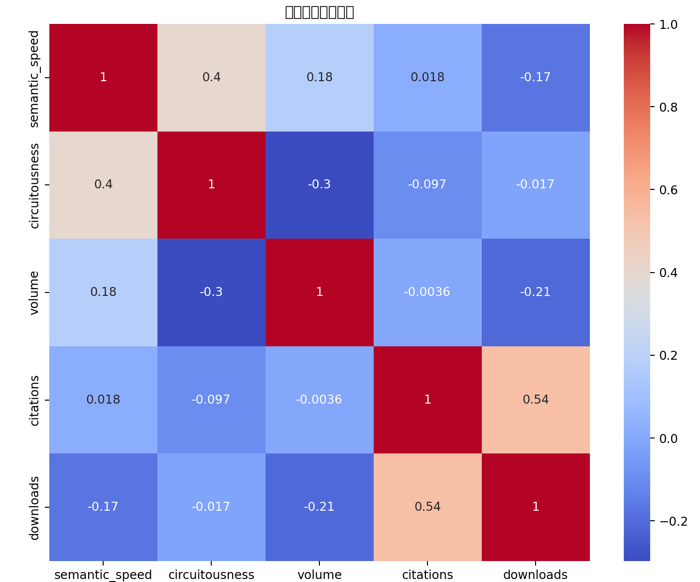

# 项目代码结构和解释
该项目的目标是通过自然语言处理技术，分析文本的语义变化和叙事特征，进而探讨这些特征与文本成功（如读者吸引力或认知负担）的潜在关系 
## 整个项目的结构tree
```
├─filtered // 分词后的数据 
│  ├─小说  
│  └─论文   
├─output   //去除空格处理后的数据
│  ├─小说   
│  └─论文   
├─resource   //用于手动初筛
│  └─论文   
├─resources   //初筛后的数据
│  ├─小说   
│  └─论文   
├─windowscev //输出窗口cev和结果
│  ├─小说   
│  ├─论文
│  └─output_results.csv 
├── spare.py            # Python 脚本，用于预处理 
├── stopwords.txt        # 停用词文件 
├── vectorization.py     # 向量化特征的文件，主文件  
├── README.md            # 项目说明文件
├── wiki.model           # Word2Vec 模型文件
├── wiki.model.syn1neg.npy    # Word2Vec 的负采样权重文件
├── wiki.model.wv.vectors.npy   # Word2Vec 的词向量文件
├─__pycache__    
└─模型训练   //训练模型
    └─wiki-word2vec-master 
``` 


是通过模型训练wiki-word2vec-master得到，里面有readme文件介绍
- 其他文件根据tree创建即可
## spare.py 过程分析
### 重要步骤
- 去除行首尾空白字符：确保每一行干净整洁。
- 跳过空行：避免不必要的处理。
- 去除行内空格：规范文本格式。
- 使用 jieba 进行中文分词：将文本拆分为有意义的词语。
- 过滤非中文字符：仅保留中文字符，避免其他字符干扰分析。
- 将处理后的词语保存到结果中：构建整个文本的分词结果。
- 写入输出文件：保存处理后的文本供后续使用。
- 进度输出：监控程序进度，确保大数据处理过程中的可控性。
## 2.vertorization.py过程分析：
### 文件准备与预处理：
- sanitize_filename 和 rename_files_in_folder 用于修复文件夹中存在的特殊字符，确保文件名符合标准。
- 通过递归遍历文件夹，对每个文件进行命名修复。
### 语义向量计算：

- 加载了一个预训练的 Word2Vec 模型（wiki.model），这是处理文本的关键。模型加载后，你使用它将文本中的每个单词转换为一个向量（300维的嵌入向量）。
- 文本被划分为窗口（默认窗口大小为 125）。对于每个窗口，代码会计算窗口中所有单词的向量均值，得到一个代表该窗口语义的向量。
### 语义分析：
- 向量多样性检查（check_vector_variability）：计算每个窗口中词向量的标准差。如果窗口中的词向量变异较大，说明该窗口的内容变化丰富；如果变异很小，说明内容可能比较单一。
- 协方差矩阵计算（check_covariance_matrix）：检查窗口中词向量的协方差矩阵和特征值，帮助理解词向量在窗口中的分布特性。
- 最小体积椭球计算（get_min_vol_ellipse）：使用协方差矩阵计算窗口向量的最小体积椭球，进而反映文本的“体积”或信息密度。
### 语义路径和速度计算：

- 欧几里得距离计算（calculate_distance_matrix）：计算相邻窗口之间的欧几里得距离，反映了语义空间中相邻窗口的变化程度。
- 语义速度（semantic_speed）：计算相邻窗口之间距离的平均值，表示语义内容的变化频率。语义速度较高表明内容变化较快，语义速度较低则表示内容变化较慢。
#### 语义迂回性计算（circuitousness）：

使用 2-opt 算法优化路径，模拟计算文本内容的“路径”。通过计算路径的最短距离与实际路径的总长度之间的比值，得到语义迂回性。迂回性较高表示文本的语义路径偏离实际最短路径较远，即文本内容较为复杂或冗长。
### 结果输出：

将每个文件的分析结果（语义速度、迂回性和体积）保存为一个 CSV 文件（output_results.csv）。
### 多线程处理：

使用 ThreadPoolExecutor 通过多线程并行处理每个文件，提高处理效率，特别是当有多个文件时，能够显著加速整个过程。
### 你可以从这段代码中得到的分析结果：
- 语义速度：通过计算窗口之间的语义变化频率，可以了解文本的节奏感。速度较高的文本可能会更频繁地跳跃到不同的主题或观点，而速度较低的文本可能更注重细节和连贯性。
- 语义迂回性：通过优化路径，你可以评估文本中语义发展的复杂性。如果文本内容的语义发展非常直接，迂回性会较低；如果文本内容通过复杂的路径展开，迂回性会较高。
- 体积：体积反映了文本在语义空间中的密度，较大的体积意味着语义内容分布广泛或多样，较小的体积则可能意味着语义内容比较集中。
### 可能的改进和进一步分析方向：
- 改进窗口划分方式：目前的窗口划分是基于固定词数（125个词）。可以尝试基于文本语义或主题切分窗口，例如按句子或段落进行切分，或者使用更加动态的窗口大小。

- 优化语义速度计算：你可以尝试不同的距离度量方法，比如余弦相似度，来替代欧几里得距离，这样可能更适合语义分析，因为词向量的空间距离未必完全符合欧几里得度量。

- 体积计算的多样化：除了几何均值，你也可以尝试使用体积的其他计算方式，或者结合其他特征（如熵）来衡量文本的复杂度。

- 多层次分析：目前的分析主要集中在文本的整体特征，可以尝试在更细粒度的层次上进行分析，比如针对不同章节或段落，分析它们的语义速度和复杂度。

- **跨文本比较：可以尝试将不同类型文本（如小说、学术论文、新闻报道等）进行对比，探讨不同类型文本的语义特征差异**。

总体来说，这段代码为文本语义分析提供了一个综合性的框架，通过计算文本的速度、迂回性和体积，可以有效揭示文本的结构和信息传播特性。这些分析结果对于进一步理解文本的叙事方式和读者的认知偏好非常有帮助。

```
论文相关性矩阵：
                 semantic_speed  circuitousness    volume  citations  downloads
semantic_speed        1.000000        0.400023  0.184033   0.018333  -0.173635
circuitousness        0.400023        1.000000 -0.296966  -0.097294  -0.017186
volume                0.184033       -0.296966  1.000000  -0.003614  -0.210208
citations             0.018333       -0.097294 -0.003614   1.000000   0.535972
downloads            -0.173635       -0.017186 -0.210208   0.535972   1.000000
小说相关性矩阵：
                 semantic_speed  circuitousness    volume    rating  rating_count
semantic_speed        1.000000       -0.020300 -0.391192  0.193457     -0.198621
circuitousness       -0.020300        1.000000 -0.572813 -0.153653     -0.220241
volume               -0.391192       -0.572813  1.000000  0.007774      0.111526
rating                0.193457       -0.153653  0.007774  1.000000      0.197550
rating_count         -0.198621       -0.220241  0.111526  0.197550      1.000000
```